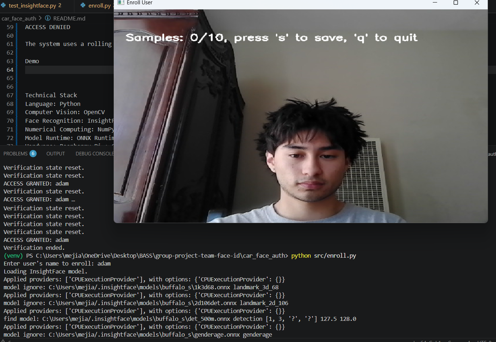
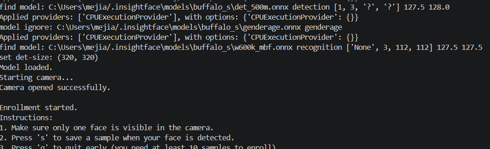
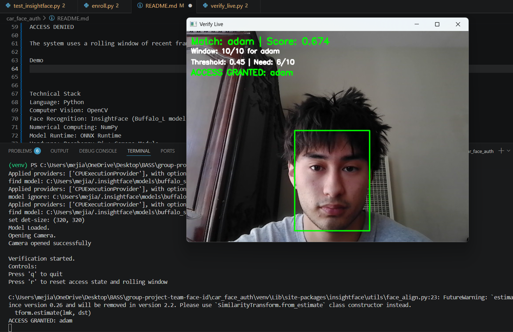

## Native Android wireless app

For the native APK, fixed QR pairing, and local Wi-Fi host setup, see
[Android wireless operation](docs/android-wireless.md). Every unlock requires
recognition by the selected backend's camera: PC webcam or Pi camera. Android
and the React dashboard control that same backend; neither UI chooses a
different camera for unlocking.

## Team members

| Name | SJSU Email | GitHub |
|------|------------|--------|
| Taanish Patel | [taanish.patel@sjsu.edu](mailto:taanish.patel@sjsu.edu) | [@pateltaanish](https://github.com/pateltaanish) |
| Adam Mejia | [adam.mejia@sjsu.edu](mailto:adam.mejia@sjsu.edu) | [@AdamMejia](https://github.com/AdamMejia) |
| Nick Thi | [nicholas.thi@sjsu.edu](mailto:nicholas.thi@sjsu.edu) | [@nicholastee22](https://github.com/nicholastee22) |
| Greg Lu | [greg.lu@sjsu.edu](mailto:greg.lu@sjsu.edu) | [@vvv017](https://github.com/vvv017) |

**Project advisor:** Eric Vanuska

---

## Project Description:
The Biometric Automobile Security System (B.A.S.S.) is a vehicle access control
prototype that uses facial recognition for authentication. A Raspberry Pi or PC
camera performs identity verification against a local database. PC lock and
ignition behavior is simulated. Real Pi motor and ignition output is currently
blocked until command acknowledgement and physical-position feedback are
implemented.

This repository contains two main pieces: a **React dashboard** for controlling and monitoring the system (`src/`), and a **Python facial-recognition PoC** that runs on a Raspberry Pi (or a dev PC) inside `car_face_auth/`.

## Repository layout

```
group-project-team-face-id/
├── src/                          # React dashboard
│   ├── components/               # UI components
│   ├── hooks/                    # useAppState, useAppActions, useApi
│   ├── utils/                    # Helper functions
│   ├── App.jsx
│   └── main.jsx
├── car_face_auth/
│   ├── src/
│   │   ├── api_server.py         # Retired standalone API; import fails closed
│   │   ├── face_engine.py        # Shared embeddings + inference (SQLite-backed)
│   │   ├── enroll.py             # Retired standalone CLI stub
│   │   ├── verify_live.py        # Retired standalone CLI stub
│   │   └── test_insightface.py   # Historical experiment; not for deployment
│   └── requirements.txt
├── db.py                         # SQLite schema + init
├── db_api.py                     # Database access layer
├── pi_device_api.py              # Injectable Flask route factory; no listener
├── bass_wireless.py              # Canonical authenticated HTTPS host
├── requirements-pi-device-api.txt
├── systemd/                      # Auto-start service files for Pi
│   └── faceid-wireless.service    # HTTPS API + camera + ESP32 owner
├── scripts/install-wireless-pi.sh # Supported Pi installer
├── install.sh                    # Retirement stub for the old service
└── ESP32_Program/                # ESP32 firmware
```

---

## Frontend (React UI)

### Quick start

```bash
npm install
npm run dev
```

Open [http://localhost:5173](http://localhost:5173) in your browser.

For PC webcam operation, also start `scripts/start-wireless.cmd`. The local
development dashboard connects to this authenticated host by default. Enroll a
face, then start Unlock from either the dashboard or the paired Android app.
The PC captures its webcam and unlocks only after a successful match. Its
actuator output remains simulated. See [host setup](docs/android-wireless.md).

Sign in to the host dashboard as an administrator and keep its Control tab open
to see the camera view when Android starts a scan. Regular users can preview
only sessions started on their own device. See [watch a phone-triggered scan](docs/android-wireless.md#watch-a-phone-triggered-scan-on-the-host).

### Hardware Simulator tab on the current PC host

Build with `npm run build`, then start the existing launcher with
`scripts/start-wireless.cmd -HardwareSimulator`. Open the normal dashboard at
`http://localhost:5057` and select **Hardware** in its sidebar. Buttons appear
in the same dashboard before and after product login; other product tabs still
require sign-in.

Explicit PC development mode trusts direct localhost dashboard clients. A local
cookie and CSRF token are created and renewed in the background. The operator
uses no separate login, activation link, or browser window for these controls.

The panel uses the current PC database and phone connection. Hold its button
for three seconds to open pairing, or ten seconds to open recovery, then release.
The backend determines the elapsed time and active window. Simulated power off
closes windows and cancels work while preserving ownership.

Existing installations retain their accounts in `legacy` ownership state. To
exercise first use, choose **Developer reset**, review its scope, and type
`RESET`. The host drains work and creates a private coherent database/identity/key
backup before clearing product data. Repeating the same reset request returns
its original receipt. A failed reset keeps the product in maintenance.

After reset, scan the activation card with the updated Android app, open the
pairing window, and set the owner's name and PIN. Export recovery material to a
safe location outside the phone. A public device QR grants no access.

Ordinary startup and Pi mode have no developer control routes. The panel works
through the actual loopback dashboard with its own background session,
same-origin checks, and CSRF token. Do not enable development mode on a host
where local clients are untrusted. It does not implement a Wi-Fi access point
or GPIO.
See [operation and recovery](docs/android-wireless.md#hardware-simulator-and-developer-reset).

### Standalone scripted hardware fixture

Normal PC operation uses its real webcam. The separate HTTP simulator below is
for scripted hardware/recognition development, not for verifying a real face.
It is not a camera or operating mode offered by the normal UI.

To test the real HTTP contract and production `PiRuntime` state machine without
Raspberry Pi / camera / ESP32 hardware, start the standalone simulator. It replaces
only the hardware and face-engine seams; scan windows, authorization, enrollment,
cancel, lock, and ignition behavior still run through the canonical Device API:

```bash
npm run mock:pi
# equivalent: python mock_pi_device_api.py
```

Use this developer fixture through its standalone API:

```text
http://localhost:5055
```

The server binds only to loopback, rejects remote peers, creates a local
`Demo Driver`, and stores its disposable SQLite data under `.cache/`. Configure
a successful camera stream from another terminal on the same computer:

```bash
curl -X PUT http://localhost:5055/sim/scenario \
  -H "Content-Type: application/json" \
  -d '{"scenario":{"frames":[{"identity":"Demo Driver","face_count":1,"score":0.91}],"frame_delay_ms":75,"camera_error":null,"camera_stalled":false},"serial_connected":true,"fail_commands":[]}'
```

The last scripted frame repeats until the session finishes. This lets the real
rolling-window logic reach its required 6 matches out of 10 observations. The
developer-only simulator controls are:

| Method | Route | Purpose |
|--------|-------|---------|
| GET | `/sim/scenario` | Inspect frames, faults, readiness, and command history |
| PUT / POST | `/sim/scenario` | Set scripted frames and failure conditions |
| GET | `/sim/commands` | Read attempted `LOCK`, `UNLOCK`, `START`, and `STOP` commands |
| POST | `/sim/reset` | Cancel active work, attempt `STOP` + `LOCK`, and restore the camera scenario |

Useful fault fields are `camera_error`, `camera_stalled`, `serial_connected`, and
`fail_commands` (any of `LOCK`, `UNLOCK`, `START`, `STOP`). A frame with
`face_count: 0` simulates no face; `face_count: 2` simulates multiple faces; an
unknown `identity` simulates a non-match. For example, this makes the ESP32 reject
unlock while leaving the database locked:

```bash
curl -X PUT http://localhost:5055/sim/scenario \
  -H "Content-Type: application/json" \
  -d '{"frames":[{"identity":"Demo Driver"}],"fail_commands":["UNLOCK"]}'
```

The HTTP simulator exercises the Python API and runtime using its scripted
frames. It is an unauthenticated, loopback-only development fixture. The normal
dashboard and Android app do not route to it.

This simulator cannot certify Picamera2 compatibility or frame rate, InsightFace
performance on the Pi, USB serial permissions, real ESP32 acknowledgements, motor
direction/limits/electrical safety, or systemd startup with attached hardware.

### Android installation and the host dashboard

Use the native APK for phone operation: see [Android wireless operation](docs/android-wireless.md).
Scan the host's fixed QR once; Android discovers that host, verifies its pinned
TLS certificate, and authenticates over HTTPS on port 5056. No USB forwarding,
browser backend address, or separate Connect action is needed for normal use.

The selected Android release candidate is the unsigned BASS 0.4.0 (versionCode
5) APK. Current artifact hashes and verification results are recorded in the
[delivery snapshot](docs/android-delivery-status.md). It must be signed before
installation or distribution; signing and build details are in the Android
wireless guide.

The built web dashboard runs only on the host at `http://localhost:5057`. Its PWA
manifest, icons, and offline shell remain available, but live controls and the
pairing QR always require the host connection. A standalone Vite preview or a
remote static website does not provide the trusted local API bridge. During
frontend development, Vite on port 5173 proxies that loopback service.

First-owner activation uses the phone, its activation card, and a device pairing
window. The dashboard signs in with an existing host account; it cannot create
the initial owner. After the first successful sign-in with a name and PIN,
the browser remembers that account and needs only its PIN when the session
expires. Explicit sign-out clears the account selection. The browser keeps its
15-minute session in an HTTP-only cookie and asks for the signed-in user's PIN before each
sensitive operation; it does not store the PIN. Administrators manage users,
access, PIN resets, phone invites, paired devices, logs, and settings. Ordinary
users can operate only as themselves and cannot open administrator controls.

### Retired standalone Face API

The old FastAPI/Uvicorn enrollment service is retired. Importing
`car_face_auth.src.api_server` raises an error instead of creating a listener.
Do not start port 8765. Normal PC and Pi operation uses `bass_wireless.py`; the
selected backend captures enrollment and verification images through the
authenticated Device API.

### Components reference

| Component | Location | Purpose |
|-----------|----------|---------|
| **Badge** | `src/components/Badge.jsx` | Small inline label |
| **Card** | `src/components/Card.jsx` | Rounded card container |
| **Btn** | `src/components/Btn.jsx` | Primary / secondary / danger / blue variants |
| **Input** | `src/components/Input.jsx` | Text input |
| **Switch** | `src/components/Switch.jsx` | Boolean toggle |
| **TabBtn** | `src/components/TabBtn.jsx` | Legacy tab styling helper |
| **Toast** | `src/components/Toast.jsx` | Notifications |
| **SidebarNav** | `src/components/SidebarNav.jsx` | Main nav (Control, Users, Logs, Settings) |
| **TopBar** | `src/components/TopBar.jsx` | Title strip, refresh, status |
| **Overview** | `src/components/Overview.jsx` | Backend / device / safety summary |
| **StatusPanel** | `src/components/StatusPanel.jsx` | Lock state, battery, signal, lock action |
| **DevicePairingCard** | `src/components/DevicePairingCard.jsx` | The current host's fixed QR for Android pairing |
| **Tabs** | `src/components/Tabs.jsx` | Tab strip helper where used |
| **ControlTab** | `src/components/ControlTab.jsx` | Backend-camera unlock and same-person ignition |
| **UsersTab** | `src/components/UsersTab.jsx` | Backend user list and face enrollment |
| **LogsTab** | `src/components/LogsTab.jsx` | Event log |
| **SettingsTab** | `src/components/SettingsTab.jsx` | Settings + save |

### Hooks reference

| Hook | Location | Purpose |
|------|----------|---------|
| **useAppState** | `src/hooks/useAppState.js` | Mode, sim, device cache, `faceApiUrl`, settings |
| **useAppActions** | `src/hooks/useAppActions.js` | Refresh, unlock, add/delete user, save settings |
| **useApi** | `src/hooks/useApi.js` | Device HTTP API vs simulation |

### Utils reference

| Utility | Location | Purpose |
|---------|----------|---------|
| **clamp** | `src/utils/helpers.js` | Clamp a number between min and max |
| **genId** | `src/utils/helpers.js` | Unique IDs for toasts, users, logs |
| **fmt** | `src/utils/helpers.js` | Format timestamp to locale string |

### Frontend features

- **One backend**: all normal controls use the selected Device API.
- **Backend camera**: PC webcam or Pi camera, selected by the running host.
- **Persistent UI state**: saved backend settings; previous simulation data is preserved.
- **Layout**: sidebar + main content, theme via `ThemeProvider` (`src/context/`).

---

## Prerequisites

### Mac
- Node.js LTS — download from [nodejs.org](https://nodejs.org)
- Python 3.11 (recommended — newer versions may not have `onnxruntime` wheels)
- Git

### Windows
- Node.js LTS — download from [nodejs.org](https://nodejs.org)
- Python 3.11 — download from [python.org](https://www.python.org/downloads/)
- Git — download from [git-scm.com](https://git-scm.com)

---

## Setup — Raspberry Pi (one time)

```bash
git clone https://github.com/SJSU-CMPE-195/group-project-team-face-id.git
cd group-project-team-face-id
```

On a development computer at the same source revision, run `npm ci` and
`npm run build`. Copy the complete generated `dist/` directory into this Pi
checkout alongside `bass_wireless.py`. Git does not include these build files,
and the Pi installer requires them before it can proceed.

Then run on the Pi:

```bash
bash scripts/install-wireless-pi.sh
```

The supported installer creates the database and persistent host identity,
installs the existing dependencies, and enables `faceid-wireless.service` as
the single camera/ESP32 owner. It also exports the pairing QR. See the
[Pi handoff](docs/android-wireless.md#pi-handoff) for build, identity-transfer,
OpenSSL, and verification details.

The root `install.sh` is a retirement stub, and the repository's
`faceid-api.service` unit is removed. The stub exits with an error and points to
the wireless installer without changing the system. During an upgrade, the
supported installer still detects enabled or active `faceid-api.service` and
`faceid-verify.service` units, reports them, and exits without changing them.
Review the installed legacy service before explicitly disabling it; the check
prevents two processes from competing for the camera or ESP32.

---

## Setup — Dashboard (Mac / Windows / Linux)

The React UI only needs Node.js. Run this from your laptop on the same WiFi network as the Pi.

### Mac / Linux

```bash
git clone https://github.com/SJSU-CMPE-195/group-project-team-face-id.git
cd group-project-team-face-id
npm ci
npm run dev
```

### Windows

```cmd
git clone https://github.com/SJSU-CMPE-195/group-project-team-face-id.git
cd group-project-team-face-id
npm ci
npm run dev
```

Open [http://localhost:5173](http://localhost:5173) in your browser.

---

## Running the full system

Use the [wireless host setup](docs/android-wireless.md) on the PC or Pi:

1. Build the dashboard and start the wireless backend. Pi deployment must
   include the built `dist/` directory; it is not included by Git.
2. Open [http://localhost:5057](http://localhost:5057) on the backend machine.
   Sign in with an existing account, or complete phone-first activation using
   the Hardware Simulator on the development PC. The dashboard automatically
   uses that service and its camera.
3. As an administrator, choose **Users → Pair phone** for the intended user.
   The dashboard displays a five-minute invitation QR.
4. Scan that invitation in BASS Android and enter the user's six-digit host PIN.
   The phone receives its own revocable credential for this backend.
5. Select **Refresh** to load new phone enrollments in **Users**.

No backend address or Connect action is needed. For local frontend development,
`http://localhost:5173` uses the same host through Vite's proxy to port 5057.
The Android app reaches the authenticated LAN API over HTTPS on port 5056.

---

## Enrolling a user

1. Sign in as an administrator and go to the **Users** tab.
2. Select the backend/device camera as the enrollment source.
3. For a new user, enter a display name and a new six-digit PIN. For an existing
   user, enter their exact display name.
4. Select **Add & enroll face**, then enter your signed-in administrator account's
   PIN. For a new user, the second prompt confirms the new user's PIN entered in
   step 3. The account is created only after the PINs match.
5. Wait for the backend to capture the required samples.

If camera enrollment fails or is cancelled, the account stays in the user list.
Retry with the same display name to enroll that account's face. Removal is a
separate action under **People & Access**.

To reset a PIN, enter the replacement PIN, approve with your signed-in account's
PIN, then confirm the replacement PIN. Resetting a PIN signs that user out on
all devices and invalidates their invitations. Their phones must be paired again.

The face embedding is stored in the selected backend's SQLite database and is available to
the Device API's scan flow.

---

## Face verification (dashboard)

1. Go to the **Control** tab
2. Start the Unlock face scan and enter the signed-in user's PIN.
3. Look at the backend's camera: PC webcam or Pi camera. Access requires the
   configured rolling-window match threshold (6 of 10 observations by default).
4. PC records simulated actuation. On Pi, all lock and ignition outputs remain
   blocked until the serial protocol has command acknowledgement and physical
   position feedback. A PIN alone or uploaded browser/phone verification frames
   cannot grant access.

The current runtime reports that presentation-attack detection is unavailable.
With the persisted liveness setting enabled by default, verification fails
closed before camera capture or actuation. An administrator may explicitly
disable that setting for prototype testing, which reduces security and does not
establish production, vehicle, or presentation-attack safety.

On Pi, startup, shutdown, manual controls, timers, and scan results cannot send
motor or ignition commands. The API reports control unavailable and physical
state unconfirmed. There is no environment-variable bypass. Enrollment and
administrator data tasks may still operate, subject to the liveness policy.

---

## Backend connection

The canonical store is **SQLite on the selected backend** (`db.py` / `db_api.py`).
React and Android read that host's users, settings, and state through the Device
API (`/api/status`, `/api/users`, ...).

### On the Pi

Use `bash scripts/install-wireless-pi.sh` from the repository root. It installs
and enables `faceid-wireless.service`, which runs `bass_wireless.py` as the
single owner of the Pi camera and ESP32 serial connection. Do not run
`pi_device_api.py` directly: it only exports `create_app(...)` for an injected
database/runtime and has no module-level application or public listener.

Runtime overrides such as `ESP32_SERIAL_PORT`, scan timeouts, enrollment sample
interval, `BASS_PORT`, and `BASS_DASHBOARD_PORT` can be placed in
`/etc/default/faceid-wireless`. The old `enroll.py` and `verify_live.py` entrypoints
exit with an error; they cannot run beside or replace the authenticated host.

Authorization adds tables to the existing SQLite database and uses the
device-adjacent `device.auth.key` as its PIN pepper. The Pi installer applies
that additive migration offline. For a manual migration, stop the service and
set the database path explicitly:

```bash
sudo systemctl stop faceid-wireless.service
FACEID_DB_PATH=/home/pi/faceid/faceid.db \
BASS_DEVICE_CONFIG=/home/pi/faceid/device.json \
  .venv-wireless/bin/python bass_wireless.py --mode pi --migrate-security-only
```

Do not run that command against the real Pi database from this worktree: no real
database migration or deployment has been performed here. Back up and restore
`device.json`, `device.tls.pem`, `device.auth.key`, and the SQLite database as
one coherent set. Startup binds that database to the configured device ID and
TLS certificate fingerprint. A mismatch fails closed before hardware or either
listener starts. The installer transfers the `device.auth.key` sidecar when
present, refuses a mismatched destination, and applies the schema and identity
binding offline before starting the service.

Replacing TLS intentionally requires a stopped host and an explicit destructive
authorization rotation. Back up the coherent set, replace `device.tls.pem` by
an operator-controlled process, then run:

```bash
FACEID_DB_PATH=/home/pi/faceid/faceid.db \
  .venv-wireless/bin/python bass_wireless.py --mode pi \
  --config /home/pi/faceid/device.json \
  --rotate-tls-authorization-only
```

This command does not generate or replace a valid TLS file. It binds the
replacement certificate atomically and revokes every phone credential, local
session, operation grant, and pairing invite. After it succeeds, start the host,
sign in locally with an administrator PIN, display the new QR, and issue new
user invites. Do not merely replace TLS and claim phones were re-paired; without
the explicit rotation the host refuses the database/TLS mismatch.

If an existing administrator loses access, keep the service stopped and run the
local interactive recovery tool; it revokes that user's existing devices and
grants:

```bash
.venv-wireless/bin/python scripts/recover-host-admin.py \
  --db /home/pi/faceid/faceid.db \
  --config /home/pi/faceid/device.json \
  --user 'Admin Name'
```

### In the UI

Normal dashboard operation uses `faceid-wireless.service` and its local page at
`http://localhost:5057`; see the [wireless Pi handoff](docs/android-wireless.md#pi-handoff).
Android uses the certificate-pinned HTTPS listener on port 5056.

### Schema (see `db.py`)

- `users`, `auth_logs`, `settings`, `device_state`

Face templates use the strict `BASSF001` numeric format. The runtime does not
deserialize legacy pickle data; existing trusted databases require the separate
[offline face-template migration](docs/android-wireless.md#face-template-migration)
before deployment. The migration creates a validated copy and does not replace
the active database automatically.

---

## Face recognition backend (Python PoC)

Facial-recognition vehicle access using a Raspberry Pi and camera: real-time detection, embeddings, local identity checks, and confidence-based unlock decisions.

### Proof-of-concept scope

**Included**

- Real-time face detection  
- Face embedding generation  
- Identity verification against a local database  
- Confidence-based access with a rolling window  

**Not in scope yet**

- Multi-user robustness testing  
- Presentation-attack detection / anti-spoofing (photo/video)
- Full vehicle integration  

**Present but safety-gated**

- The ESP32 serial command protocol and integration code remain in the
  repository, but the real Pi runtime blocks all motor and ignition output until
  acknowledgement and position feedback exist. No connected hardware was
  exercised, so this is not physical or production-safety acceptance.

### Prerequisites

- Python 3.8+ (3.11–3.12 recommended on Windows if prebuilt wheels are missing)
- Raspberry Pi (or PC for development)
- A camera attached to the backend: Pi Camera Module on Pi or a USB webcam on PC.
- Virtual environment (required on Pi, recommended on dev PC)

**Python dependencies:** `requirements-http.txt` pins Flask 3.1.3, Werkzeug
3.1.8, Pillow 12.3.0, Cheroot 11.1.2, and pyOpenSSL 26.4.0.
`requirements-pi-device-api.txt` adds `pyserial` and the recognition stack:
`insightface`, `onnxruntime`, OpenCV, and NumPy. Picamera2 is installed by
Raspberry Pi OS with
`sudo apt install python3-picamera2` and exposed to `.venv` via
`--system-site-packages`.

### Running recognition and enrollment

See [Android wireless operation](docs/android-wireless.md) for the PC/Pi host,
pairing, and local dashboard setup. Both UIs ask the backend to capture the face
for unlock. There is no separate Face API listener.

The standalone `enroll.py` and `verify_live.py` CLIs are retired because they
bypass the authenticated host and used the older face-template path. They exit
without opening the camera, serial port, or database. `test_insightface.py` is a
historical experiment only and is not a deployment or migration tool.

### Historical PoC screenshots

These images show the earlier experimental CLI and are not instructions for the
current authenticated host.

**Enrollment**



**Enrollment terminal output**



**Verify live**



---

## Device API routes (`pi_device_api.py`)

| Method | Route | Description |
|--------|-------|-------------|
| GET | `/api/status` | Device status, lock state, battery, signal |
| POST | `/api/unlock` | Retired; use PIN-authorized `/api/scan/start` |
| POST | `/api/lock` | Lock the device |
| POST | `/api/ignition/stop` | Stop ignition |
| POST | `/api/full-reset` | Stop ignition and lock the device |
| GET | `/api/users` | List all users for an administrator or the current user only |
| POST | `/api/users` | Add a new user; `enroll_face: true` also returns a one-use `enrollment_grant` for that user |
| DELETE | `/api/users/<id>` | Remove a user |
| PATCH | `/api/users/<id>/access` | Enable/disable face access for a user |
| POST | `/api/users/<id>/pin` | Reset a user PIN (administrator only) |
| POST | `/api/operation-grants` | Verify current PIN for one action and target |
| POST | `/api/session-login` | Verify the saved phone account's PIN without granting an operation |
| POST | `/api/pairing-invites` | Issue a five-minute user invite (administrator only) |
| GET | `/api/devices` | List paired phones (administrator only) |
| POST | `/api/devices/<id>/revoke` | Revoke one phone (administrator only) |
| POST | `/api/verify-log` | Retired; returns 410 and writes no event |
| POST | `/api/scan/start` | Start a backend-camera unlock or same-driver ignition scan |
| GET | `/api/scan/status?session_id=<id>` | Read scan progress/result |
| POST | `/api/scan/cancel` | Cancel a running backend-camera scan |
| POST | `/api/scan/sample` | Rejected: client images cannot verify unlock/ignition |
| POST | `/api/enroll/start` | Start backend-camera or client-camera enrollment |
| GET | `/api/enroll/status?session_id=<id>` | Read enrollment progress/result |
| POST | `/api/enroll/cancel` | Cancel a running enrollment |
| GET | `/api/logs` | Retrieve auth logs (administrator only) |
| GET | `/api/settings` | Get device settings |
| POST | `/api/settings` | Save device settings |
| GET | `/health` | Process liveness and runtime details |
| GET | `/ready` | Hardware readiness (`503` until camera/model/ESP32 are ready) |

`/health` proves that the API process is alive and includes `runtime_ready` plus
camera/model/ESP32 details. It does not replace an on-Pi hardware acceptance test.
`pi_device_api.py` only defines the injected route factory. `bass_wireless.py`
wraps it with per-device authentication and serves it through bounded Cheroot
11.1.2 workers with pyOpenSSL 26.4.0: Android uses HTTPS port 5056, while the
session-authenticated dashboard bridge is available only on loopback HTTP port
5057. See [wireless API and recovery](docs/android-wireless.md#api-and-recovery)
for its contract. There is no standalone port 5000 listener.

The host rejects requests larger than 9 MiB and JSON bodies larger than 64 KiB.
Client enrollment accepts JPEG only, up to 8 MiB, 4096 pixels on either axis,
and 4,194,304 total pixels. Oversized input returns 413 before the runtime
performs enrollment or a data-changing operation. Client requests to
`POST /api/verify-log` return 410 and cannot create an authoritative event.

The fixed QR supplies TLS-pinned onboarding information only. Pairing also
requires a short-lived administrator-issued invite and the target user's
six-digit host PIN. The host then issues a separate revocable phone credential.
Each sensitive operation requires a fresh 30-second grant bound to the signed-in
user, action, and target. Earlier shared QR keys are rejected for ordinary API
operations.

---

## Tech stack

| Area | Technology |
|------|------------|
| Dashboard | React + Vite + Tailwind CSS |
| Face recognition | InsightFace (buffalo_s model) |
| Device API | Flask route factory behind Cheroot + pyOpenSSL |
| Database | SQLite via db_api.py |
| Camera (Pi) | Picamera2 |
| Hardware control | pyserial → ESP32 (CAN migration planned; see below) |
| Auto-start | systemd |

---

---

## Hardware wiring

All pin numbers below are taken from the firmware actually in this repository
(`ESP32_Program/src/Step_Motor_Lock.ino`). Note that `ESP32_Program/ReadMe.md` is
**out of date**: it describes an earlier build that used two DC motors on a single
L298N. The current firmware drives the lock with a 28BYJ-48 stepper through a
ULN2003 instead.

### Bill of materials

| Component | Role | Notes |
|---|---|---|
| Raspberry Pi 5 | Host: camera, recognition, API, dashboard | Runs `bass_wireless.py` |
| Pi Camera Module (CSI) | Enrollment and unlock capture | Pi 5 uses a **22-pin 0.5 mm** cable, not the 15-pin Pi 4 type |
| ESP32 (WROOM, CP2102N USB) | Motor controller | Appears as `/dev/ttyUSB0` |
| L298N dual H-bridge | DC motor driver | Engine ignition motor |
| DC motor | Simulates engine ignition | Driven from L298N OUT1/OUT2 |
| ULN2003 driver board | Stepper driver | Normally ships with the 28BYJ-48 |
| 28BYJ-48 stepper | Simulates the door lock actuator | 2048 half-steps per lock throw |
| MCP2515 CAN module | CAN controller for the Pi | SPI — **see the voltage warning below** |
| SN65HVD230 transceiver | CAN transceiver for the ESP32 | Natively 3.3 V, correct for the ESP32 |
| External 12 V supply | Motor power | Never power motors from the ESP32 |

### ESP32 GPIO allocation

| GPIO | Signal | Connects to |
|---|---|---|
| 14 | `ENA` — PWM, 1 kHz, 8-bit | L298N `ENA` |
| 26 | `IN1` | L298N `IN1` |
| 27 | `IN2` | L298N `IN2` |
| 18 | `STEP_IN1` | ULN2003 `IN1` |
| 16 | `STEP_IN2` | ULN2003 `IN2` |
| 21 | `STEP_IN3` | ULN2003 `IN3` |
| 22 | `STEP_IN4` | ULN2003 `IN4` |
| 4 | CAN RX *(planned)* | SN65HVD230 `CRX` / `R` |
| 5 | CAN TX *(planned)* | SN65HVD230 `CTX` / `D` |

GPIO 4 and 5 are unused by the motor code, so adding the CAN transceiver creates
no pin conflict.

### DC motor — engine ignition (L298N)

| ESP32 | L298N |
|---|---|
| GPIO14 | `ENA` |
| GPIO26 | `IN1` |
| GPIO27 | `IN2` |
| GND | `GND` (must be common with the supply) |

| L298N terminal | Connects to |
|---|---|
| `+12V` | External 12 V supply (+) |
| `GND` | Supply (−) **and** ESP32 GND |
| `OUT1` | DC motor terminal 1 |
| `OUT2` | DC motor terminal 2 |

Speed is PWM on `ENA` through `ledcAttach(ENA, 1000, 8)`, so `SPEED 0`–`SPEED 255`
maps directly onto duty cycle. Direction comes from IN1/IN2: `HIGH`/`LOW` runs the
motor, `LOW`/`LOW` lets it coast to a stop.

### Stepper motor — door lock (ULN2003 + 28BYJ-48)

| ESP32 | ULN2003 |
|---|---|
| GPIO18 | `IN1` |
| GPIO16 | `IN2` |
| GPIO21 | `IN3` |
| GPIO22 | `IN4` |
| GND | `GND` (common) |

| ULN2003 | Connects to |
|---|---|
| `+5V` | 5 V supply — the L298N's onboard 5 V regulator can provide this |
| `GND` | Common ground |
| 5-pin socket | 28BYJ-48 keyed connector |

The firmware constructs the stepper like this:

```cpp
AccelStepper lockMotor(AccelStepper::HALF4WIRE, STEP_IN1, STEP_IN3, STEP_IN2, STEP_IN4);
```

`STEP_IN2` and `STEP_IN3` are deliberately swapped in that call. This is the
correct coil ordering for a 28BYJ-48 driven through a ULN2003 — do not "correct"
it to sequential order, or the motor will buzz and vibrate without rotating. One
lock throw is `LOCK_STEPS = 2048` half-steps.

### CAN bus — Raspberry Pi side (MCP2515, SPI)

> **Voltage warning — read before powering on.** Most MCP2515 breakout boards (the
> ones carrying a TJA1050 transceiver) are designed to run at 5 V. At 5 V the
> module's `SO`/MISO pin drives roughly 5 V into the Pi's GPIO 9, which is
> **3.3 V only and not 5 V tolerant**. This can damage the SoC. Choose one of:
> power the module from 3.3 V (Pin 1) instead — the MCP2515 itself runs fine at
> 3.3 V, and on a short two-node bench bus against a 3.3 V SN65HVD230 this
> generally works; or level-shift the MISO line alone; or use a 3.3 V-native
> module.

| MCP2515 pin | Pi physical pin | Pi signal |
|---|---|---|
| `VCC` | 1 (preferred) or 2 | 3.3 V — or 5 V, with the warning above |
| `GND` | 6 | GND |
| `CS` | 24 | GPIO8 / SPI0 CE0 |
| `SO` | 21 | GPIO9 / SPI0 MISO |
| `SI` | 19 | GPIO10 / SPI0 MOSI |
| `SCK` | 23 | GPIO11 / SPI0 SCLK |
| `INT` | 22 | GPIO25 |

`INT` on GPIO25 must match the `interrupt=` value in the device-tree overlay below.

### CAN bus — ESP32 side (SN65HVD230)

| SN65HVD230 pin | ESP32 |
|---|---|
| `VCC` / `3V3` | 3V3 — **not** 5 V |
| `GND` | GND (common) |
| `CTX` / `D` | GPIO5 (TWAI TX) |
| `CRX` / `R` | GPIO4 (TWAI RX) |

### CAN bus — between the two nodes

| MCP2515 (Pi) | SN65HVD230 (ESP32) |
|---|---|
| `CANH` | `CANH` |
| `CANL` | `CANL` |

Both ends of a CAN bus need a 120 Ω termination resistor — two in total, no more
and no fewer. Both modules usually carry one on board, enabled by a jumper or
solder bridge; with exactly two nodes, enable both. Verify with a multimeter:
measure across `CANH`/`CANL` with everything powered **off** and expect roughly
**60 Ω** (the two 120 Ω resistors in parallel).

### Power and ground rules

- **One common ground.** ESP32 GND, L298N GND, ULN2003 GND and the 12 V supply
  negative must all be tied together, or control signals have no reference and
  behaviour becomes erratic.
- **Never drive motors from the ESP32's 3V3 or 5V pins.** Motor current must come
  from the external supply through the driver boards.
- The ESP32 itself is powered over USB from the Pi during testing.
- Bring the 12 V supply up only after the signal wiring has been checked.

## Hardware integration (ESP32)

Firmware and setup notes live under **`ESP32_Program`** on the `wired-main` branch:

https://github.com/SJSU-CMPE-195/group-project-team-face-id/tree/wired-main/ESP32_Program

The retained ESP32 protocol defines these serial commands:

| Command | Action |
|---------|--------|
| `UNLOCK` | Unlock door (stepper to the unlocked position) |
| `LOCK` | Lock door (stepper to the locked position) |
| `START` | Start ignition (DC motor on; `ON` is accepted as an alias) |
| `STOP` | Stop ignition (DC motor off; `OFF` is accepted as an alias) |
| `SPEED X` | Set ignition motor speed, `X` from 0 to 255 |

The current Pi runtime does not send these commands. It reports
`actuator_control_available: false`, `physical_state_confirmed: false`, and
`actuator_feedback: "unavailable"`. PC and developer-fixture runtimes may execute
the same state machine only with `simulated_actuators: true`; their results do
not describe physical hardware.

---

## CAN bus migration (planned, not yet implemented)

**Status: design only.** No CAN code exists in this repository yet — the Pi still
talks to the ESP32 over USB serial at 115200 baud. This section records the
intended change so the wiring above has context.

### Why this matters more than a protocol swap

The Pi deliberately blocks every physical actuator output today:

```python
actuator_control_available = False
actuator_block_reason = (
    "Physical actuator output is disabled until command feedback is "
    "implemented and validated."
)
```

Over plain serial the Pi can only know that bytes left the UART — never that the
lock actually moved. Rather than fire motors blindly, the runtime gates them.
This gate disables the whole unlock scan flow in the dashboard, not just the motor
output; enrollment and administrator tasks stay available.

CAN supplies exactly what that gate is waiting for: frames are acknowledged at the
hardware level, and a status frame returned by the ESP32 reports real lock and
ignition state. **Completing this migration is what unblocks the motors**, which is
why it is the critical path for full-system integration.

### Proposed frame format

| ID | Direction | Payload |
|---|---|---|
| `0x100` | Pi → ESP32 | `[cmd, arg, counter]` — cmd: 1=LOCK, 2=UNLOCK, 3=START, 4=STOP, 5=SPEED (`arg` 0–255) |
| `0x101` | ESP32 → Pi | `[locked, engine_on, speed, last_cmd_echo]` |

Fixed 8-byte frames remove the string parsing and partial-read handling that the
current `Serial.readStringUntil('\n')` loop needs.

### Raspberry Pi OS configuration

Add to `/boot/firmware/config.txt`:

```
dtparam=spi=on
dtoverlay=mcp2515-can0,oscillator=16000000,interrupt=25
```

Set `oscillator=` to match the crystal can soldered to your MCP2515 board —
**8 MHz and 16 MHz are both common**. A mismatch brings the interface up cleanly
and then passes zero frames, which is the single most common cause of a CAN bus
that appears dead for no visible reason.

After a reboot:

```bash
sudo ip link set can0 up type can bitrate 500000
candump can0      # from can-utils
```

Confirm frames move with `candump` **before** writing any Python. Use the same
bitrate on both nodes; 500 kbit/s is the automotive norm.

### Code that will change

| Area | File |
|---|---|
| Add `python-can` | `requirements-pi-device-api.txt` |
| Replace the serial transport with a CAN bus handle | `car_face_auth/src/pi_runtime.py` |
| Replace the `_send_command` stub with a real send + ACK wait | `car_face_auth/src/pi_runtime.py` |
| Remove USB-descriptor port discovery (`ESP_KEYWORDS`, `_find_esp_port`) | `car_face_auth/src/pi_runtime.py` |
| Add a receive path for `0x101` status frames | `car_face_auth/src/pi_runtime.py` |
| Rename `esp32_connected` / `serial_port` status fields to CAN equivalents | `car_face_auth/src/pi_runtime.py`, dashboard status consumers |
| Provide a CAN twin of `_SimulatedSerial` | `car_face_auth/src/simulated_runtime.py` |
| Port the command loop to the TWAI driver (`driver/twai.h`) and emit status frames | `ESP32_Program/src/Step_Motor_Lock.ino` |
| Update serial mocks | `tests/test_runtime_safety.py`, `tests/test_simulated_pi_api.py` |

Keeping the `_send_command(command: str) -> bool` signature and swapping only its
body means the scan, unlock and auto-relock logic above it needs no changes.

### Security note

CAN has no authentication. Any node physically on the bus can inject an unlock
frame and the ESP32 will obey. That is not a defect in this design — it is how
real vehicle CAN buses behave, and it underpins most published car-hacking work.
Because the goal here is a realistic vehicle environment, this prototype
reproduces that property faithfully. The careful authentication, session and
authorization work described earlier in this README protects the **network API**;
it does not extend to the CAN bus. A rolling counter plus a short MAC on command
frames would mitigate it if the project chooses to go further.

---

## Troubleshooting

### `rpicam-hello --list-cameras` reports "No cameras available!"

A lit LED on the camera board only proves the 3.3 V and GND pins are making
contact. Sensor detection happens over a separate I2C pair on the same ribbon.
Confirm what the kernel actually sees:

```bash
v4l2-ctl --list-devices          # expect an rp1-cfe entry, not only pispbe
dmesg | grep -iE "rp1-cfe|imx|ov5"
ls /dev/i2c-*                    # a camera creates its own I2C bus
```

If there is no `rp1-cfe` entry and no camera I2C bus, no overlay was loaded.
`camera_auto_detect=1` recognises official Raspberry Pi modules only and fails
silently on third-party boards. Force the sensor explicitly in
`/boot/firmware/config.txt` and reboot:

```
camera_auto_detect=0
dtoverlay=ov5647,cam0
```

Substitute `imx219`, `imx477` or `imx708` as appropriate, and `cam1` for the other
connector. If the sensor then probes, auto-detect simply did not know the board.
If `dmesg` instead reports `failed to read chip id`, the software is now correct
and the fault is physical — reseat the ribbon, confirm you are using a **22-pin
0.5 mm** Pi 5 cable rather than a 15-pin Pi 4 cable, and try the other connector.

CSI cameras are enumerated only at boot, so a camera connected to a running Pi
will never appear until it is rebooted.

### Enrollment and unlock scans return 503

`liveness_detection` defaults to `true`, but presentation-attack detection is not
implemented (`liveness_available = False`). `car_face_auth/src/runtime_safety.py`
fails closed in that combination. An administrator can disable the setting under
**Settings** for prototype testing; doing so reduces security and does not
establish production or anti-spoofing safety.

### A user exists but has no face template

Creating an account and capturing a face are separate steps, and the account
persists if capture fails. Re-enrol by entering that user's **exact display name**
in **Users → Display Name**, leaving the PIN box empty, and selecting **Add &
enroll face**. An existing name is matched case-insensitively and reused rather
than duplicated. The PIN field is required only when creating a new account.

### "Start face unlock" is greyed out

`canStartScan` requires `actuatorControlAvailable`, which is `false` on the Pi by
design. See the CAN migration section above. There is no environment-variable
bypass.

### `STOP, LOCK command was not sent` at startup

The same actuator gate, reported at boot. It is not a serial fault, a wiring
problem or an ESP32 failure.

### The dashboard shows stale UI

The host serves the built `dist/` directory. Run `npm run build` after frontend
changes, or use `npm run dev` on port 5173 during development.

### The host cannot find its database

`--mode pi` defaults to `/home/pi/faceid/faceid.db`. On a Pi whose user is not
`pi`, set the path explicitly:

```bash
export FACEID_DB_PATH=/home/<user>/faceid/faceid.db
```
