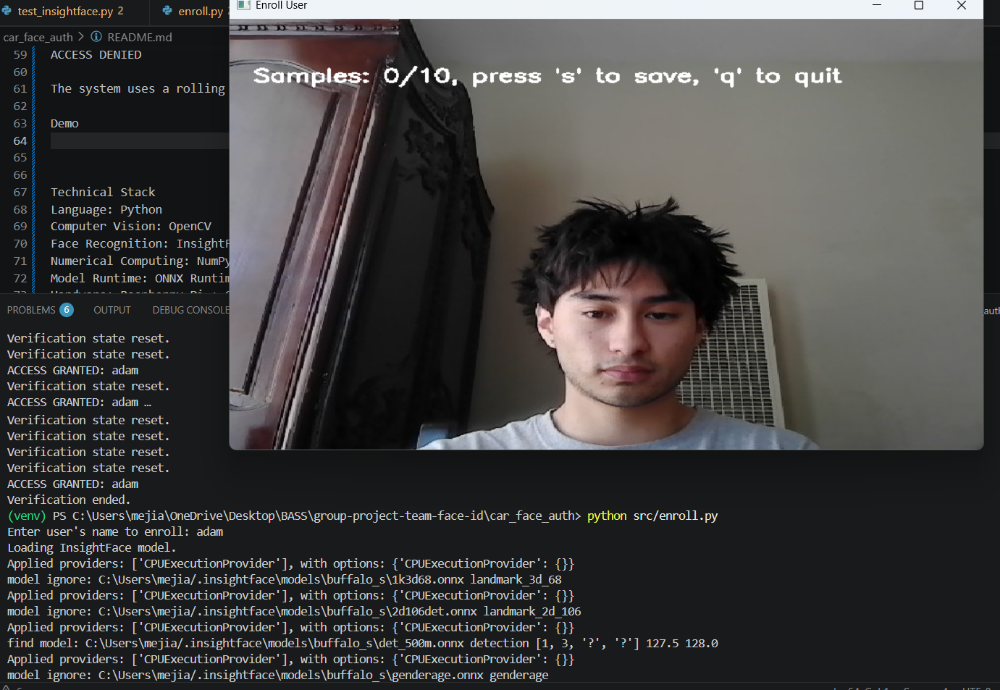
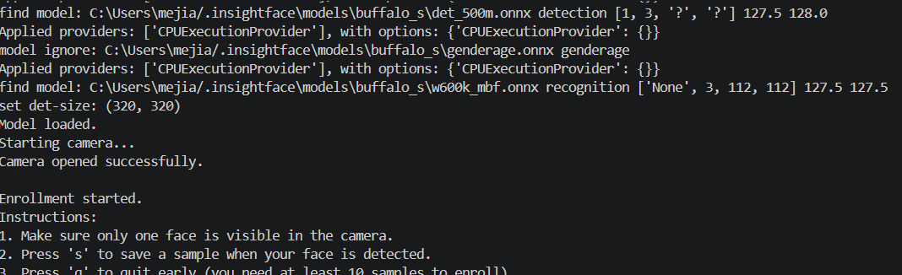
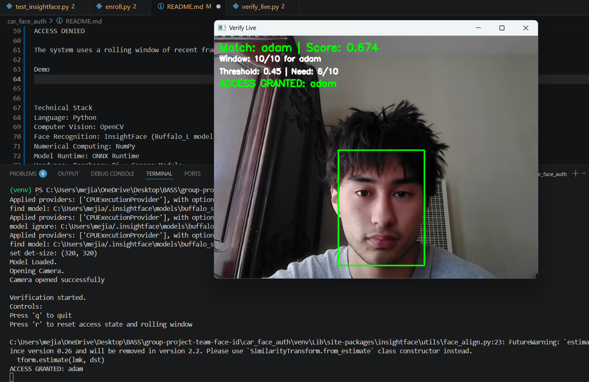

# 🚗 Facial Recognition Vehicle Access System

## 📌 Project Description  
This project implements a facial-recognition-based vehicle access system using a Raspberry Pi and camera module. The system identifies authorized users in real time and simulates unlocking a vehicle when a valid face is detected with high confidence.

---

## 🔍 Proof of Concept Scope  
The Proof of Concept demonstrates:
- Real-time face detection  
- Face embedding generation  
- Identity verification using a local database  
- Confidence-based access decisions with a rolling window  

**Not included yet:**
- Physical door lock / ignition control  
- Multi-user robustness testing  
- Anti-spoofing (photo/video protection)  
- Full vehicle system integration  

---

## ⚙️ Prerequisites  
- Python 3.8+  
- Raspberry Pi (or PC for development)  
- Camera (Pi Camera Module or USB webcam)  
- Virtual environment (recommended)  

### Required Libraries
- opencv-python  
- numpy  
- insightface  
- onnxruntime (or onnxruntime-gpu)  

---

## 🛠️ Installation  

### 1. Clone the repository
```bash
git clone <your-repo-url>
cd <your-repo-name>

!!!Note: You will need to switch to the Machine-Learning branch and cd into car_face_auth for this to work !!!

2. Create a virtual environment
python -m venv venv

Activate it:

# Mac/Linux
source venv/bin/activate

# Windows
venv\Scripts\activate
3. Install dependencies
pip install -r requirements.txt
4. Connect your camera

Make sure your camera is properly connected and accessible.

▶️ Running the PoC
Step 1: Enroll a User
python enroll.py
Enter a username
The system captures multiple frames
Face embeddings are stored locally
Step 2: Run Live Verification
python verify_live.py
✅ Expected Output
Face bounding boxes
Similarity score
Status messages:
ACCESS PENDING
ACCESS GRANTED

The system uses a rolling window of frames to improve stability and reduce false positives.

🎥 Demo
Part 1: Enrollment


Part 2: Terminal Response for Enrollment


Part 3: Verify Live


🧠 Technical Stack
Language: Python
Computer Vision: OpenCV
Face Recognition: InsightFace (Buffalo_s)
Numerical Computing: NumPy
Runtime: ONNX Runtime
Hardware: Raspberry Pi + Camera
Storage: Pickle (embeddings database)
🚀 What's Next (195B)
Integrate physical door lock and ignition system
Improve robustness to lighting and head movement
Implement anti-spoofing protection
Optimize performance for Raspberry Pi
Conduct user testing and evaluate system accuracy